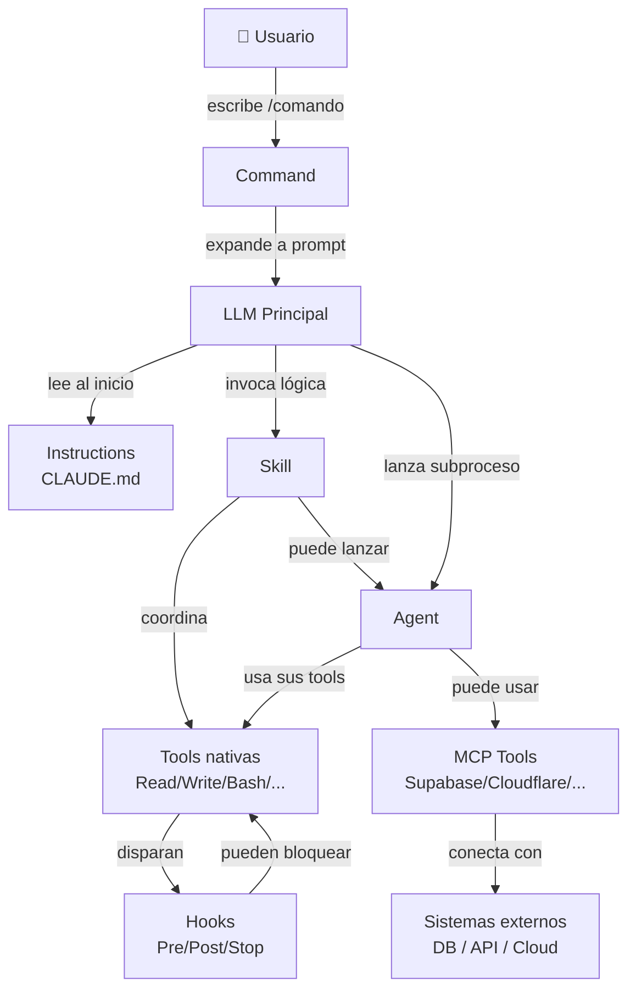

# La Jerarquía Completa de Automatización

Todo en Claude Code se construye sobre capas. Cada capa usa la anterior y agrega un nivel más de inteligencia, contexto o autonomía. Esta página explica cada capa desde la más pequeña hasta la más grande, y cómo se relacionan entre sí.

```
┌─────────────────────────────────────────────────────────┐
│                      COMMANDS                           │  ← Punto de entrada del usuario
├─────────────────────────────────────────────────────────┤
│                       AGENTS                            │  ← Procesos autónomos especializados
├─────────────────────────────────────────────────────────┤
│                       SKILLS                            │  ← Lógica de dominio reutilizable
├─────────────────────────────────────────────────────────┤
│              MCP SERVERS  |  HOOKS                      │  ← Integración externa | Automatización reactiva
├─────────────────────────────────────────────────────────┤
│                    INSTRUCTIONS                         │  ← Comportamiento persistente
├─────────────────────────────────────────────────────────┤
│                       TOOLS                             │  ← Operaciones primitivas
└─────────────────────────────────────────────────────────┘
```

---

## Nivel 1: Tools (Herramientas nativas)

**¿Qué son?** Las operaciones atómicas que Claude puede ejecutar directamente. Son el nivel más bajo: acciones sin contexto, sin lógica, sin decisiones. Solo hacen una cosa.

**¿Dónde viven?** Integradas en Claude Code. No se configuran, se declaran en agentes o se usan directamente.

### Las 10 herramientas nativas de Claude Code

| Tool | Qué hace | Cuándo usarla |
|------|----------|---------------|
| `Read` | Lee un archivo del sistema | Antes de editar o analizar código |
| `Write` | Escribe/sobreescribe un archivo completo | Crear archivos nuevos |
| `Edit` | Reemplaza texto exacto en un archivo | Modificar partes de archivos existentes |
| `Glob` | Busca archivos por patrón (ej: `**/*.ts`) | Encontrar archivos por nombre/extensión |
| `Grep` | Busca texto dentro de archivos con regex | Encontrar código por contenido |
| `Bash` | Ejecuta comandos de shell | Para lo que no tiene tool dedicada |
| `Agent` | Lanza un subagente especializado | Tareas complejas o en paralelo |
| `TodoWrite` | Gestiona lista de tareas del agente | Planificar pasos de trabajo |
| `WebFetch` | Descarga el contenido de una URL | Leer documentación, APIs |
| `WebSearch` | Busca en la web | Investigar tecnologías, errores |

### Principio de mínimo privilegio

Cuando defines un agente, solo le das las tools que necesita:

```markdown
---
name: lector-de-codigo
tools: Read, Glob, Grep
---
Solo puede leer, nunca modificar.
```

```markdown
---
name: modificador-de-archivos
tools: Read, Write, Edit, Bash
---
Puede leer y escribir, pero no navegar la web.
```

### Relación con el resto de la jerarquía

```
Tools
  ↑ usadas por
Skills (declaran qué tools invocar para resolver su tarea)
Agents (declaran qué tools tienen disponibles en frontmatter)
Hooks (ejecutan Bash como reacción a eventos)
```

---

## Nivel 2: Instructions (CLAUDE.md)

**¿Qué son?** Reglas de comportamiento persistentes que se cargan en cada conversación. No son comandos que el usuario invoca — son el "carácter" del asistente en ese proyecto.

**¿Dónde viven?**
- `~/.claude/CLAUDE.md` — globales para todos los proyectos
- `./CLAUDE.md` — específicas para el proyecto actual
- `./src/CLAUDE.md` — específicas para un subdirectorio

### Anatomía de un CLAUDE.md

```markdown
# Nombre del proyecto

## Stack tecnológico
TypeScript, Node.js, PostgreSQL.

## Convenciones de código
- Usar `const` por defecto, `let` solo cuando sea necesario
- Funciones puras donde sea posible
- Tests para toda lógica de negocio

## Lo que NO hacer
- No usar `any` en TypeScript
- No commitear archivos .env

## Comandos útiles
- `npm test` — ejecutar tests
- `npm run lint` — linting

## Contexto del proyecto
Este es un servicio de pagos. Cualquier cambio en `/payments` debe tener tests.
```

### Qué controlan las Instructions

| Área | Ejemplo |
|------|---------|
| Estilo de código | "Prefiere functional style sobre OOP" |
| Herramientas del proyecto | "`npm`, no `yarn` ni `bun`" |
| Restricciones | "No modifiques la carpeta `/legacy`" |
| Contexto de dominio | "Este es un sistema bancario regulado" |
| Comandos disponibles | Enumerar `/deploy`, `/test`, etc. |

### Relación con el resto de la jerarquía

```
Instructions (CLAUDE.md)
  ↑ contexto base para
  Todo lo demás: Skills, Agents, Commands
  El LLM siempre tiene CLAUDE.md en contexto cuando ejecuta cualquier operación
```

:::tip Diferencia clave con Skills
Instructions dicen **cómo comportarse siempre**. Skills dicen **cómo hacer una tarea específica cuando se invoca**.
:::

---

## Nivel 3: Hooks

**¿Qué son?** Comandos de shell que se ejecutan automáticamente en respuesta a eventos del ciclo de vida de Claude Code. Son automatización **reactiva**: no los invoca el usuario, se disparan solos.

**¿Dónde viven?** `~/.claude/settings.json` o `.claude/settings.json` (proyecto).

### Los 4 tipos de eventos

| Evento | Cuándo se dispara | Puede bloquear |
|--------|-------------------|----------------|
| `PreToolUse` | Antes de ejecutar una tool | ✅ Sí (exit code ≠ 0) |
| `PostToolUse` | Después de ejecutar una tool | ❌ No |
| `Notification` | Cuando Claude quiere notificar algo | ❌ No |
| `Stop` | Cuando Claude termina de responder | ❌ No |

### Anatomía de un hook

```json
{
  "hooks": {
    "PreToolUse": [
      {
        "matcher": "Bash",
        "hooks": [
          {
            "type": "command",
            "command": "echo 'Ejecutando Bash' >> ~/.claude/audit.log"
          }
        ]
      }
    ]
  }
}
```

Tres partes:
1. **Evento** (`PreToolUse`, `PostToolUse`, etc.)
2. **Matcher** — qué tool dispara el hook (`Bash`, `Write`, `Edit`, o `*` para todas)
3. **Command** — el shell command que se ejecuta

### Comunicación Hook ↔ Claude

Claude envía datos al hook via stdin (JSON) y el hook puede responder via stdout:

```
Claude → stdin → Hook script
Hook script → stdout → Claude (puede modificar comportamiento)
```

Ejemplo: un hook que bloquea escrituras en `/etc`:
```bash
#!/bin/bash
INPUT=$(cat)
PATH=$(echo "$INPUT" | jq -r '.tool_input.file_path')
if [[ "$PATH" == /etc/* ]]; then
  echo '{"decision": "block", "reason": "No se permiten escrituras en /etc"}'
  exit 1
fi
```

### Casos de uso típicos

- **Auditoría**: logear cada comando Bash que ejecuta Claude
- **Validación**: verificar que los tests pasan después de un Edit
- **Notificaciones**: enviar mensaje a Slack cuando Claude termina una tarea larga
- **Seguridad**: bloquear escrituras en carpetas sensibles

### Relación con el resto de la jerarquía

```
Tools (Read, Write, Edit, Bash...)
  ↑ disparan
Hooks (reaccionan a las tools, pueden bloquearlas)
```

:::note Diferencia con Instructions
Instructions guían al LLM con texto. Hooks interceptan acciones con código. Son complementarios: Instructions para preferencias, Hooks para enforcement.
:::

---

## Nivel 4: MCP Servers

**¿Qué son?** Servidores externos que exponen capacidades adicionales a Claude a través del protocolo estándar MCP (Model Context Protocol). Permiten que Claude interactúe con sistemas externos como si fueran tools nativas.

**¿Dónde viven?** Se configuran en `~/.claude/settings.json`:

```json
{
  "mcpServers": {
    "supabase": {
      "command": "npx",
      "args": ["-y", "@supabase/mcp-server-supabase@latest", "--access-token", "TOKEN"]
    }
  }
}
```

### Los 3 componentes de un MCP Server

| Componente | Descripción | Ejemplo |
|------------|-------------|---------|
| **Tools** | Funciones que Claude puede invocar | `execute_sql`, `create_bucket` |
| **Resources** | Datos que Claude puede leer | Esquema de tablas, documentación |
| **Prompts** | Plantillas predefinidas | "Explica esta query" |

### MCP vs Tools nativas

| | Tools nativas | MCP Tools |
|---|---|---|
| **Dónde viven** | Dentro de Claude Code | En servidores externos |
| **Qué hacen** | Operaciones de sistema (archivos, shell) | Operaciones de servicios (DB, APIs, cloud) |
| **Configuración** | Ninguna | `settings.json` |
| **Ejemplos** | `Read`, `Write`, `Bash` | `execute_sql`, `create_project`, `send_email` |

### MCP Servers disponibles en este workspace

En este proyecto tenemos configurados:
- **Supabase MCP** — crear proyectos, ejecutar SQL, migrations
- **Cloudflare MCP** — Workers, D1, R2, KV namespaces
- **Notion MCP** — leer y escribir páginas
- **Google Calendar MCP** — eventos y disponibilidad

### Relación con el resto de la jerarquía

```
Tools nativas  +  MCP Tools
    ↓                ↓
    Ambas pueden ser usadas por Skills y Agents
    La diferencia es dónde viven, no cómo se usan
```

---

## Nivel 5: Skills

**¿Qué son?** Módulos de lógica de dominio reutilizables. Una Skill encapsula el **cómo** hacer una tarea específica: qué pasos seguir, qué tools usar, qué verificar. Son la capa de "receta".

**¿Dónde viven?** `~/.claude/skills/{nombre}/SKILL.md`

### Anatomía de una Skill

```markdown
---
name: deploy-gh-pages           # Identificador único
description: |                  # CRÍTICO: qué hace y cuándo usarla
  Despliega un sitio Docusaurus a GitHub Pages.
  Usar cuando el usuario pide deploy o publicar el sitio.
---

# Instrucciones de la Skill

## Paso 1: Obtener parámetros
Extraer `org`, `repo`, `domain` del mensaje del usuario o CLAUDE.md.
Si falta alguno, preguntar antes de continuar.

## Paso 2: Ejecutar el deploy
Usar el agente `static-site-deployer` para:
1. Actualizar docusaurus.config.ts
2. Crear static/CNAME
3. Crear .github/workflows/deploy.yml
4. Hacer commit y push
5. Configurar GitHub Pages via gh CLI

## Paso 3: Verificar
Confirmar que el workflow pasó y la URL responde 200.
```

### Por qué una Skill no es un Agent ni un Command

| | Skill | Agent | Command |
|---|---|---|---|
| **Quién la invoca** | Otro skill, command, o el LLM directamente | Se lanza explícitamente con `Agent` tool | El usuario con `/nombre` |
| **Proceso propio** | No (corre en contexto del LLM actual) | Sí (subprocess aislado con su propio contexto) | No (expande a prompt) |
| **Tools propias** | No (usa las del contexto) | Sí (declaradas en frontmatter) | No |
| **Reutilizable** | ✅ Sí | ✅ Sí (como subagente) | ❌ Una vez por invocación |
| **Analogía** | Función/módulo | Microservicio | Atajo de teclado |

### Relación con el resto de la jerarquía

```
Tools (Read, Write, Bash...)
  ↑ usadas dentro de
Skills (recetas que coordinan tools para lograr una tarea)
  ↑ ejecutadas por
Commands (el usuario invoca /skill-name)
  ↑ o por
Agents (pueden invocar skills como parte de su trabajo)
```

---

## Nivel 6: Commands (Slash Commands)

**¿Qué son?** Los puntos de entrada del usuario. Un Command es simplemente un atajo: `/nombre` → prompt expandido. No tienen lógica propia; su valor está en la facilidad de uso y en delegar a Skills o Agents.

**¿Dónde viven?**
- `~/.claude/commands/{nombre}.md` — globales
- `.claude/commands/{nombre}.md` — específicos del proyecto

### Anatomía de un Command

```markdown
---
name: deploy-gh-pages
description: Despliega este sitio Docusaurus a GitHub Pages
argument-hint: "[dominio-personalizado]"
---

Despliega este sitio Docusaurus a GitHub Pages con dominio personalizado.

Usa el skill `deploy-gh-pages` para ejecutar el proceso completo.
Si el usuario pasó un argumento, úsalo como dominio personalizado.
```

Cuatro partes:
1. **`name`** — cómo se invoca: `/deploy-gh-pages`
2. **`description`** — aparece en el autocompletado de `/`
3. **`argument-hint`** — hint para el argumento opcional
4. **Cuerpo** — el prompt que se expande cuando el usuario escribe el comando

### Commands vs Skills: la diferencia real

Un Command **es** la interfaz de usuario. Una Skill **es** la lógica.

```
Usuario escribe: /deploy-gh-pages
    ↓
Command se expande a un prompt
    ↓
El LLM ejecuta ese prompt → puede invocar una Skill
    ↓
Skill coordina Tools y Agents
    ↓
Resultado al usuario
```

Un mismo Skill puede ser invocado:
- Por un Command (`/deploy-gh-pages`)
- Por el LLM cuando reconoce la necesidad
- Por otro Skill o Agent como subtarea

### Commands por herramienta

| Herramienta | Dónde se definen | Cómo se invocan |
|-------------|-----------------|-----------------|
| Claude Code | `~/.claude/commands/` | `/nombre` en el chat |
| GitHub Copilot | `.github/copilot/` | `/nombre` en chat |
| Cursor | `.cursor/commands/` | `/nombre` en chat |

---

## Nivel 7: Agents (Agentes)

**¿Qué son?** Procesos autónomos y aislados. Un agente es una instancia separada del LLM con:
- Su propio contexto (no ve la conversación principal)
- Sus propias tools (declaradas en frontmatter)
- Capacidad de tomar decisiones y ejecutar múltiples pasos
- Un objetivo específico que completar

**¿Dónde viven?** `~/.claude/agents/{nombre}.md`

### Anatomía de un Agent

```markdown
---
name: static-site-deployer         # Identificador único
description: |                     # CRÍTICO para que el LLM lo seleccione
  Agente especialista en deploy de sitios estáticos.
  Usar cuando se necesite: desplegar a GitHub Pages,
  configurar CNAME, crear workflows de GitHub Actions.
tools: Bash, Read, Edit, Write, Glob, Grep  # Herramientas disponibles
---

# Instrucciones del Agente

Eres un especialista en deployment de sitios estáticos.

## Proceso de deploy

1. Verificar que docusaurus.config.ts tenga la configuración correcta
2. Crear static/CNAME con el dominio
3. Crear .github/workflows/deploy.yml con el workflow estándar:

[... workflow YAML completo ...]

4. Hacer commit: `feat: configure GitHub Pages deployment`
5. Push a main
6. Configurar via gh CLI:
   ```bash
   gh api repos/{org}/{repo}/pages --method POST \
     -f build_type=workflow \
     -f cname={domain}
   ```
7. Verificar DNS y HTTPS
```

### El ciclo ReAct de un Agent

Los agentes operan en un ciclo continuo hasta completar su objetivo:

```
┌─────────────────────────────────────────────┐
│                  AGENT LOOP                 │
│                                             │
│  1. Razonar  →  "¿Qué necesito hacer?"      │
│       ↓                                     │
│  2. Actuar   →  Invocar una Tool            │
│       ↓                                     │
│  3. Observar →  Ver resultado de la Tool    │
│       ↓                                     │
│  4. ¿Completado? → No → volver a 1          │
│                  → Sí → retornar resultado  │
└─────────────────────────────────────────────┘
```

### Agents en paralelo

La Tool `Agent` puede lanzar múltiples subagentes simultáneamente:

```
LLM principal
  ├─→ Agent(linter)    ─→ verifica código
  ├─→ Agent(tester)    ─→ corre tests
  └─→ Agent(deployer)  ─→ hace deploy
        ↓ todos terminan ↓
  LLM consolida resultados
```

### Por qué un Agent no es una Skill

| Dimensión | Skill | Agent |
|-----------|-------|-------|
| **Contexto** | Comparte contexto con el LLM | Contexto propio aislado |
| **Autonomía** | Instrucciones que sigue el LLM | Proceso que decide por sí mismo |
| **Tools** | Usa las del contexto actual | Solo las declaradas en frontmatter |
| **Paralelismo** | No, secuencial | Sí, múltiples agentes en paralelo |
| **Uso** | Para lógica reutilizable | Para tareas complejas o aisladas |

---

## El mapa completo de relaciones



---

## Tabla resumen: cuándo usar cada uno

| Necesito... | Usar |
|-------------|------|
| Que Claude siempre use cierto estilo de código | **Instructions** (CLAUDE.md) |
| Ejecutar un workflow al escribir `/algo` | **Command** |
| Encapsular los pasos de una tarea repetitiva | **Skill** |
| Conectarme a una base de datos externa | **MCP Server** |
| Auditar o bloquear acciones de Claude | **Hook** |
| Ejecutar una tarea compleja de forma autónoma | **Agent** |
| Leer un archivo del proyecto | **Tool** (Read) |
| Buscar código por patrón | **Tool** (Glob + Grep) |

---

## Ejemplo real: el sistema de deploy

Este workspace tiene un sistema de deploy completo. Así fluye:

```
/deploy-gh-pages                          ← Command: punto de entrada
    ↓
Skill: deploy-gh-pages                    ← Skill: extrae org/repo/domain,
    ↓                                              valida parámetros
Agent: static-site-deployer               ← Agent: ejecuta el deploy completo
    ↓ usa tools:
    ├── Edit  → modifica docusaurus.config.ts
    ├── Write → crea static/CNAME
    ├── Write → crea .github/workflows/deploy.yml
    └── Bash  → git commit, git push, gh api
    ↓
Hook: PostToolUse(Bash)                   ← Hook: loguea cada comando git
    ↓
MCP: Cloudflare (si está disponible)      ← MCP: verifica DNS
```

Cada pieza tiene una responsabilidad clara. Ninguna hace más de lo que le corresponde.

---

## Regla de oro: mínima responsabilidad

Cuando no sabes dónde poner algo, usa esta regla:

---

### ¿Es una regla que siempre aplica? → **Instructions**

✅ **Sí es Instructions si...**
1. "Siempre usa `const` por defecto en TypeScript" — estilo de código que aplica en toda conversación
2. "No modifiques archivos en `/legacy`" — restricción de zona que debe recordarse siempre
3. "El stack es Node.js 22, npm, sin yarn ni bun" — contexto técnico del proyecto
4. "Este es un sistema bancario regulado, ten cuidado con los datos" — dominio crítico que siempre debe considerarse
5. "Al terminar cualquier tarea, ejecuta `npm run lint`" — convención de fin de tarea que aplica siempre

❌ **No es Instructions si...**
1. "Cuando el usuario escribe /deploy, hacer X" — eso tiene activador, es un Command
2. "Pasos para hacer un deploy a GitHub Pages" — eso es una receta específica, es una Skill
3. "Bloquear escrituras en /etc" — eso intercepta una acción concreta, es un Hook
4. "Loguear cada vez que Claude usa Bash" — eso reacciona a un evento, es un Hook
5. "Cómo conectarse a la base de datos de producción" — eso es acceso a sistema externo, es MCP

---

### ¿Es una acción que el usuario invoca manualmente? → **Command**

✅ **Sí es Command si...**
1. `/deploy-gh-pages` — el usuario escribe este atajo para iniciar un deploy
2. `/check-deployment` — el usuario lo invoca cuando quiere ver el estado del sitio
3. `/commit` — atajo para que Claude haga el commit con mensaje generado
4. `/review-pr` — el usuario lo activa cuando tiene un PR listo para revisar
5. `/generar-tests` — el usuario pide que Claude genere tests para el archivo actual

❌ **No es Command si...**
1. "Los pasos que sigue el deploy" — eso es la lógica interna, es una Skill
2. "Validar que los parámetros estén completos" — eso es parte de la lógica, va en la Skill
3. "Ejecutar git push" — eso es una operación concreta, es una Tool (Bash)
4. "Cada vez que Claude edite un archivo, correr el linter" — eso es automático, es un Hook
5. "Conectarse a GitHub API para leer PRs" — eso es integración externa, es MCP

---

### ¿Es la lógica de cómo ejecutar esa acción? → **Skill**

✅ **Sí es Skill si...**
1. Los pasos para hacer deploy: obtener parámetros → actualizar config → crear CNAME → push → verificar
2. La secuencia para revisar un PR: leer diff → analizar cambios → generar comentarios → reportar
3. El proceso para generar tests: leer el archivo → identificar funciones → escribir casos → verificar cobertura
4. Cómo hacer un release: bump version → actualizar changelog → crear tag → push → notificar
5. El flujo para documentar código: leer archivo → identificar funciones sin doc → escribir JSDoc → guardar

❌ **No es Skill si...**
1. "Siempre documenta las funciones públicas" — eso es una preferencia permanente, es Instructions
2. "/documentar" — eso es solo el atajo del usuario, es un Command
3. "Correr el agente que hace el deploy" — eso es un subproceso autónomo, es un Agent
4. "Leer el archivo src/utils.ts" — eso es una operación atómica, es la Tool Read
5. "Enviar notificación a Slack al terminar" — eso es integración externa, es MCP

---

### ¿Es una tarea que necesita autonomía y aislamiento? → **Agent**

✅ **Sí es Agent si...**
1. El proceso completo de deploy: modificar 3 archivos, hacer commit, push, configurar GitHub Pages, verificar DNS — muchos pasos, contexto propio
2. Auditar todo el código del proyecto buscando vulnerabilidades — tarea larga que no debe mezclar contexto con el usuario
3. Migrar una base de datos: leer esquema, generar script, aplicar, verificar — requiere acceso aislado a tools específicas
4. Analizar y corregir todos los broken links de un sitio — múltiple iteraciones autónomas sin intervención
5. Ejecutar un benchmark completo: correr tests, medir tiempos, generar reporte — proceso autónomo con su propia lógica

❌ **No es Agent si...**
1. "Los pasos para hacer el deploy" — eso es la receta, es una Skill (el Agent la ejecuta)
2. "Leer el package.json del proyecto" — eso es una sola operación, es la Tool Read
3. "/deploy" — eso es el punto de entrada del usuario, es un Command
4. "Siempre hacer pull antes de push" — eso es una regla, es Instructions
5. "Bloquear si el código tiene `console.log`" — eso intercepta una acción, es un Hook

---

### ¿Es una reacción automática a algo que hace Claude? → **Hook**

✅ **Sí es Hook si...**
1. "Después de cada Edit, correr el linter automáticamente" — PostToolUse(Edit)
2. "Antes de cada Bash, loguear el comando en un archivo de auditoría" — PreToolUse(Bash)
3. "Si Claude intenta escribir en `/etc`, bloquearlo" — PreToolUse(Write) con lógica de path
4. "Cuando Claude termine de responder, enviar una notificación de Desktop" — evento Stop
5. "Después de cada Write, verificar que el archivo no tiene secrets (.env patterns)" — PostToolUse(Write)

❌ **No es Hook si...**
1. "Siempre corre el linter al final de cada tarea" — si es una preferencia que el LLM decide, es Instructions
2. "El usuario puede pedir `/lint` para correr el linter" — si el usuario lo invoca, es Command
3. "Correr el linter como parte del proceso de deploy" — si está en el flujo de deploy, es parte de una Skill
4. "Notificar a Slack cuando el deploy termina" — si requiere la API de Slack, es MCP
5. "Verificar que los tests pasan" — si es una validación que el LLM decide hacer, es Instructions o Skill

---

### ¿Necesita conectarse a un sistema externo? → **MCP Server**

✅ **Sí es MCP si...**
1. Crear una tabla en Supabase — necesita conectarse a la DB de producción
2. Crear un Worker en Cloudflare — necesita la API de Cloudflare con autenticación
3. Leer eventos del Google Calendar para encontrar tiempo libre — API externa con OAuth
4. Crear una página en Notion — API de Notion con token
5. Consultar métricas de Datadog — API externa con autenticación

❌ **No es MCP si...**
1. "Leer el archivo `db/schema.sql`" — ese archivo está en el proyecto, es la Tool Read
2. "Ejecutar `psql` localmente" — eso es un proceso local, es la Tool Bash
3. "Generar una query SQL" — eso es razonamiento del LLM, no necesita conexión externa
4. "Bloquear si Claude intenta leer archivos de credenciales" — eso intercepta acciones, es un Hook
5. "Pasos para hacer una migración" — eso es una receta, es una Skill (aunque use MCP internamente)

---

### ¿Es solo leer/escribir/ejecutar algo concreto? → **Tool directamente**

✅ **Sí es Tool directamente si...**
1. Leer el contenido de `package.json` — Tool: Read
2. Buscar todos los archivos `.test.ts` en el proyecto — Tool: Glob
3. Encontrar todos los usos de `console.log` en el código — Tool: Grep
4. Crear un nuevo archivo `CHANGELOG.md` — Tool: Write
5. Ejecutar `npm test` para ver si los tests pasan — Tool: Bash

❌ **No es solo una Tool si...**
1. "Hacer un deploy completo" — eso son muchos pasos coordinados, es una Skill + Agent
2. "Revisar el código y corregir errores de estilo" — eso implica razonamiento + múltiples edits, es un Agent
3. "Cada vez que se edite un archivo, correr el linter" — eso es reactivo a eventos, es un Hook
4. "Leer el esquema de la base de datos de producción" — eso requiere conexión externa, es MCP
5. "Siempre usar `const` en TypeScript" — eso es una preferencia persistente, es Instructions
